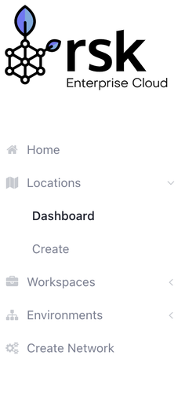

To get started with using RSK Enterprise, you will need to create your Location


<!-- Toggling With Multimeter</em>" class="border-0" style="width:100%;">  -->
## What is a Location?

A location is a group of infrastructure services self-managed by the platform. Among these services are:

Cluster AKS (Azure Kubernetes Service)
API gateways
Monitoring
Alerting
Storage *

These locations can be deployed in the different Azure regions

*According to the need (Regulatory compliance and residence of the data, Availability of services and Prices)*

## Creating Locations
To create a new location, click on Create on the sidebar and fill in the required details. 



The required details and what they do are explained below:
* Name: You'll be able to identify the location by the name in the dashboard, choose a name short but representative
* Provider: The provider is the company that will give you the main service, where the VM's will be located.
* Region: The region is the physical placement where the VM's will be, this may affect latency for example.
* Subscription: The subscription grants everything you need to use the platform reliably and securely. Providing access to Extrimian SAAS extra services, to a group of experts, security updates and 7x24 support (According to contracted plan).
* Resource Group: It is a logical grouping that contains related resources for an Azure solution. The resource group can include all the resources for the solution, or only those resources that you want to manage as a group.
* VM Size: The size of VM's is the power of computing that each VM is capable of handling.
* Amount: The number of virtual machines of the size selected that you will require.
* Tenant ID: Microsoft Azure data, come with the Subscription data. The tenant ID is the identifier of the representative of an organization.
* Client ID: Microsoft Azure data, come with the Subscription data. The client ID is the identifier of the user of the product.
* Secret: Microsoft Azure data, come with the Subscription data.
* Client ID AKS: Microsoft Azure data comes with registering an Azure application. These fields are for authenticating and validating the use.
* Client AKS Secret: Microsoft Azure data comes with registering an Azure application. These fields are for authenticating and validating the use.

Once the required information has been filled click on the create button.
Your location is now created!

## Viewing your information on the dashboard
On the dashboard you can view all the locations created.
With the + sign you can easily create a location from the dashboard.



Clicking on each location, shows the different information that each location has: General Info, Virtual Machine Size, Development info and Workspaces

 

### General Info

* Status: Status of the location,if active the location is fully functional
* Provider: Provider of the service in a location
* Owner: If owned you are the full owner of the location. It can be shared too.
* Region: Physical ubication of the server containing the virtual location
* Resource Group: It is a logical grouping that contains related resources for an Azure solution. The resource group can include all the resources for the solution or only the resources you want to manage as a group.
### Virtual Machine Size

* Vm Size: Name of the size of the VM you can search it on the internet for full specification
* Amount: Amount of virtual machine is the location
* Memory: Random access memory available to each virtual machine
* Cores: Amount of cores on each virtual machine
* Storage: Storage available in the virtual machine.
### Development Info

* Tenant ID: Microsoft Azure data, come with the Subscription data. The tenant ID is the identifier of the representative of an organization.
* Client ID: Microsoft Azure data, come with the Subscription data. The client ID is the identifier of the user of the product.
* Client ID AKS: Microsoft Azure data comes with registering an Azure application. These fields are for authenticating and validating the use.
* Subscription ID: Microsoft Azure data comes with registering an Azure application. These fields are for authenticating and validating the use.
* Creation Date: Date when the location was created.

**Note**: Your workspace info will be filled once your workspace is created.

